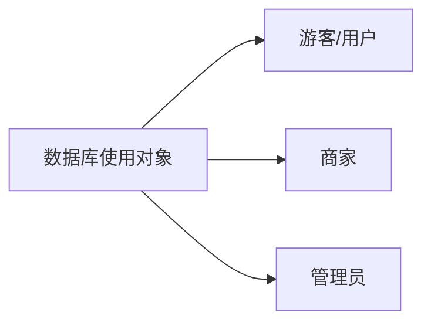

<div style="page-break-after:always;"></div>

# 一、需求分析

​		本作业旨在设计一个 B2C 线上购物系统，实现用户购买商品、开设店铺等基本功能以及管理员的管理等。因此，我们首先分析确定数据库的使用对象共用三类人群：游客/用户、商家及管理员，具体介绍如下：



**(1) 游客/用户**

​		游客是未在网站上进行注册的用户，其仅能浏览商品，不能进行任何操作。而游客注册之后则正式成为线上购物平台用户，可以进行购买、收藏、评价商品，也可以将商品添加到购物车中等操作。用户的购买通过订单实现；用户可以向管理员提交开设店铺或者投诉的申请，拥有店铺的用户同时对店铺进行管理。

​		**由于游客无法对界面进行任何操作，故接下来不再单独分析游客行为。**

**(2) 商家**

​		商家主要进行商品的销售，对用户的订单进行处理。

**(3) 管理员**

​		管理员主要对用户提交的事物进行处理。

# 二、数据库设计

## 2.1 数据库环境说明

操作系统：Windows 10
数据库系统：SQL Server 2019
数据库编码方式为 utf-8，数据库中主要字符的编码格式为 utf-8。其中一个英文字符占用 1 个字节，一个中文字符占用三个字节。

## 2.2 概念设计


**解释**：

包含7个实体和10个联系

- 实体：
  - 用户：用户编号、用户名、登录密码、
  - 管理员：管理员编号、用户编号、
  - 事务：事务编号、事务类型、事务状态
  - 店铺：店铺编号、店铺名、地址
  - 商品：商品编号、商品名称、商品描述
  - 订单：订单编号、总金额
  - 购物车：购物车编号

- 联系：
  - 用户提交事务：内容描述
  - 管理员处理事务：处理备注
  - 用户管理店铺
  - 用户拥有购物车：购物车编号
  - 购物车包含商品：商品数量
  - 用户评价商品：内容、分值
  - 用户下单
  - 订单包含商品：商品数量
  - 店铺处理订单
  - 店铺销售商品：销量、库存、售价、进价

## 2.3 逻辑设计

&emsp;&emsp;为了不与SQL Server关键字重复，"用户表"、"管理员表"、"事务表"的表名并不设为"user"、"admin"以及"transaction"，而是在三个表名之后添加'_inf'。

| 表名         | 英文名          | 功能说明             |
| ------------ | --------------- | -------------------- |
| 用户表       | user_inf        | 保存用户信息         |
| 管理员表     | admin_inf       | 保存管理员信息       |
| 事务表       | transaction_inf | 记录事务信息         |
| 店铺表       | shop            | 记录店铺信息         |
| 商品表       | goods           | 保存商品信息         |
| 商品图片表   | goods_image     | 保存商品的预览图地址 |
| 商品属性表   | goods_attribute | 记录商品的属性信息   |
| 订单中商品表 | goods_in_orders | 记录订单中的商品信息 |
| 购物车表     | shopping_cart   | 保存购物车信息       |
| 分类表       | category        | 提供两层分类         |

###  (1) 用户表

| 列名     | 数据类型（精度范围） | 空/非空 | 主键 | 外键 | 含义     | 备注                                                         |
| -------- | -------------------- | ------- | ---- | ---- | -------- | ------------------------------------------------------------ |
| user_id  | 整型                 | 非空    | 是   |      | 用户编号 | 主键，从1开始自增                                            |
| username | 可变字符型（25位）   | 非空    |      |      | 用户名   | 注册/登录时填写。唯一 。字母、数字、'-'、下划线的组合，以字母开头 |
| password | 可变字符型（120位）  | 非空    |      |      | 登录密码 | MD5加密后结果                                                |
| nickname | 可变字符型（20位）   |         |      |      | 昵称     | 默认为用户名                                                 |
| phone    | 字符型 (11位)        | 非空    |      |      | 手机号   | 注册/登陆时填写。唯一                                        |
| email    | 可变字符型 (20位)    | 非空    |      |      | 邮箱号   | 注册/登陆时填写。唯一                                        |
| avatar   | 可变字符型（50位）   |         |      |      | 头像     | 图片地址，默认头像为 `images/avatars/default.jpg`。当用户自主设置时，采用时间格式`yyyyMMddHHmmssSSS`(精确到毫秒)并追加随机3位(10以内)数字 + '.jpg' 形式存储于文件系统中, 并更新数据库中图片地址 |
| sex      | 枚举类型             |         |      |      | 性别     | 男，女，保密三选一                                           |
| birthday | 日期类型             |         |      |      | 出生日期 |                                                              |
| province | 可变字符型（20位）   |         |      |      | 省份     |                                                              |
| is_valid | 布尔型               | 非空    |      |      | 状态     | 默认为true                                                   |

###  (2) 管理员表

| 英文名   | 数据类型（精度范围） | 空/非空 | 主键 | 外键 | 含义       | 说明                                                       |
| -------- | -------------------- | ------- | ---- | ---- | ---------- | ---------------------------------------------------------- |
| admin_id | 整型                 | 非空    | 是   |      | 管理员编号 | 主键                                                       |
| user_id  | 整形                 | 非空    |      |      | 用户编号   | 每一个管理员实际上为一个用户，通过用户id确认其是否为管理员 |

###  (3) 事务表

| 列名               | 数据类型（精度范围） | 空/非空                 | 主键 | 外键 | 含义       | 说明                     |
| ------------------ | -------------------- | ----------------------- | ---- | ---- | ---------- | ------------------------ |
| transaction_id     | 整型                 | 非空                    | 是   |      | 事务编号   | 主键，从1开始自增        |
| user_id            | 整型                 | 非空                    |      | 是   | 用户编号   | 外键，提交人             |
| admin_id           | 整型                 |                         |      | 是   | 管理员编号 | 外键，处理人，提交时为空 |
| transaction_type   | 枚举类型             | 非空                    |      |      | 事务类型   | 开店申请，用户投诉       |
| transaction_status | 枚举类型             | 非空                    |      |      | 事务状态   | 未处理，已通过，已拒绝   |
| comment            | 可变字符型（300位）  | 非空 ,不超过 100 个汉字 |      |      | 内容描述   |                          |
| commit_time        | 时间类型             | 非空                    |      |      | 提交时间   |                          |
| complete_time      | 时间类型             |                         |      |      | 完毕时间   |                          |
| is_valid           | 布尔型               | 非空                    |      |      | 状态       | 默认为true               |

###  (4) 店铺表

| 列名            | 数据类型（精度范围） | 空/非空 | 主键 | 外键 | 含义     | 说明                                              |
| --------------- | -------------------- | ------- | ---- | ---- | -------- | ------------------------------------------------- |
| shop_id         | 整型                 | 非空    | 是   |      | 店铺编号 | 主键，自增                                        |
| user_id         | 整型                 | 非空    |      | 是   | 用户编号 | 外键，绑定的用户                                  |
| shop_name       | 可变字符型（90位）   | 非空    |      |      | 店铺名称 | 不超过 30 个汉字                                  |
| address         | 可变字符型（150位）  | 非空    |      |      | 店铺地址 | 不超过 50 个汉字                                  |
| phone           | 字符型（11位）       | 非空    |      |      | 联系方式 | 用户手机号                                        |
| shop_describe   | 可变字符型（300位）  |         |      |      | 店铺描述 | 未设置则显示默认值--"暂无描述"。不超过 100 个汉字 |
| announcement    | 可变字符型（300位）  |         |      |      | 公告     | 未设置则显示默认值--"暂无公告"。不超过 100 个汉字 |
| evaluate_sum    | 长整型               |         |      |      | 总评分   | 店铺总评分，初始为0                               |
| evaluate_number | 长整型               |         |      |      | 评分人数 | 评价过的人数，初始为0                             |
| is_valid        | 布尔型               | 非空    |      |      | 状态     | 默认为true                                        |
| apply_status    | 枚举类型             | 非空    |      |      | 申请状态 | 未处理，已通过，已拒绝                            |

### (5) 商品表

| 列名              | 数值类型            | 空/非空 | 主键 | 外键 | 含义         | 备注                       |
| ----------------- | ------------------- | ------- | ---- | ---- | ------------ | -------------------------- |
| goods_id          | 整型                | 非空    | 是   |      | 商品编号     | 从1开始自增                |
| category_id       | 整型                | 非空    |      | 是   | 分类编号     |                            |
| shop_id           | 整型                | 非空    |      |      | 是           | 店铺编号                   |
| goods_name        | 可变字符型（90位）  | 非空    |      |      | 商品名称     | 不超过 30 汉字             |
| goods_describe    | 可变字符型（300位） |         |      |      | 商品描述     | 不超过 100 汉字            |
| sales             | 整型                | 非空    |      |      | 销量         | 默认为0                    |
| discount_deadline | 时间类型            |         |      |      | 打折截止时间 | 默认为 2000-01-01 00:00:00 |
| discount_rate     | double              |         |      |      | 打折比例     | 默认为1                    |
| is_valid          | 布尔型              | 非空    |      |      | 状态         | 默认为true                 |

### (6) 商品图片表

| 列名       | 数值类型       | 空/非空 | 主键 | 外键 | 含义     | 备注                                                         |
| ---------- | -------------- | ------- | ---- | ---- | -------- | ------------------------------------------------------------ |
| image_id   | 整型           | 非空    | 是   |      | 图像编号 | 从1开始自增                                                  |
| goods_id   | 整型           | 非空    |      | 是   | 商品编号 |                                                              |
| image_addr | 字符型（50位） | 非空    |      |      | 图像地址 | 采用时间格式`yyyyMMddHHmmssSSS`(精确到毫秒)并追加随机3位(10以内)数字 + '.jpg' 。每次获取图像时，根据图像地址排序，最多获取最近上传的 6 张 |
| is_valid   | 布尔型         | 非空    |      |      | 状态     | 默认为true                                                   |

### (7) 商品属性表

| 列名      | 数值类型 | 空/非空 | 主键 | 外键 | 含义     | 备注       |
| --------- | -------- | ------- | ---- | ---- | -------- | ---------- |
| goods_id  | 整型     | 非空    |      | 是   | 商品编号 |            |
| cost      | double   | 非空    |      |      | 进价     |            |
| price     | double   | 非空    |      |      | 售价     |            |
| inventory | 整型     | 非空    |      |      | 库存     | 默认为0    |
| is_valid  | 布尔型   | 非空    |      |      | 状态     | 默认为true |

### (8) 订单中商品表

| 列名           | 数值类型            | 空/非空 | 主键 | 外键 | 含义       | 备注                              |
| -------------- | ------------------- | ------- | ---- | ---- | ---------- | --------------------------------- |
| order_id       | 长整型              | 非空    | 是   |      | 订单编号   | 提交订单时系统自动生成，从 1 开始 |
| goods_id       | 整型                | 非空    |      |      | 商品编号   |                                   |
| goods_num      | 整型                | 非空    |      |      | 商品数量   |                                   |
| cost           | double              | 非空    |      |      | 交易时成本 | 用户不可见                        |
| actual_price   | double              | 非空    |      |      | 成交价     |                                   |
| comment        | 可变字符型（300位） |         |      |      | 评价内容   | 不超过 100 个汉字                 |
| evaluate_score | 短整型              |         |      |      | 评价分值   | 0~5,5个评分等级                   |
| time           | 时间类型            | 非空    |      |      | 下单时间   |                                   |
| shop_id        | 整型                | 非空    |      | 是   | 店铺编号   |                                   |
| user_id        | 整型                | 非空    |      | 是   | 用户编号   |                                   |

###  (9) 购物车表

| 列名      | 数据类型（精度范围） | 空/非空 | 主键 | 外键 | 含义           | 备注                                                         |
| --------- | -------------------- | ------- | ---- | ---- | -------------- | ------------------------------------------------------------ |
| cart_id   | 长整型               | 非空    | 是   |      | 购物车记录编号 | 从1开始自增                                                  |
| user_id   | 整型                 | 非空    |      |      | 用户编号       |                                                              |
| goods_id  | 整型                 | 非空    |      |      | 商品编号       | 为保证查询效率，增加的goods_id冗余                           |
| goods_num | 整型                 | 非空    |      |      | 商品数量       | $\geq 1$， 当用户删除商品时，将 is_valid 改为 false，而不将商品数量减为 0 |
| is_valid  | 布尔型               | 非空    |      |      | 状态           | 默认为true                                                   |

###  (10) 分类表

| 列名          | 数据类型（精度范围） | 空/非空 | 主键 | 外键 | 含义     | 备注       |
| ------------- | -------------------- | ------- | ---- | ---- | -------- | ---------- |
| category_id   | 整型                 | 非空    | 是   |      | 分类编号 | 大分类     |
| category_name | 可变字符型（30位）   | 非空    |      |      | 分类名   | 分类名     |
| is_valid      | 布尔型               | 非空    |      |      | 状态     | 默认为true |

##  2.4  安全性设计

​		提高软件系统的安全性应当从“管理”和“设计”两方面着手。这里仅考虑数据库的安全性设计。

###  2.4.1 防止用户直接操作数据库的方法

​		一般用户只能用帐号登陆到网站，通过网站访问数据库，而没有其它途径操作数据库。

###  2.4.2 用户帐号密码的加密方法

​		尝试对用户帐号的密码进行加密处理，确保在任何地方都不会出现密码的明文。用户在前端注册后，密码通过form表单传输给后端，Python后端读取密码后通过`hashlib.md5()`编码写进数据库，数据库管理员也无法通过数据库直接获得密码的明文。用户登录时数据库提取对应的用户名由系统对密码进行解码并进行匹配，若一致则能登入网站。


###  2.4.3 角色与权限

​		如无特别说明，只有管理员可以查看各表的编号。

​		商家同时具有用户的所有权限。

<table border="1">
<tr>
 <th>角色</th>
 <th>可以访问的表与列</th>
 <th>操作权限</th>
</tr>
<tr>
 <th rowspan="4">用户</th>
 <td>商品表所有列</td>
 <td>检索</td>
</tr>
<tr>
 <td>分类表所有列</td>
 <td>检索</td>
</tr>
<tr>
 <td>商品属性表：除了进价</td>
 <td>检索</td>
</tr>
<tr>
 <td>店铺表所有列</td>
 <td>检索</td>
</tr>   <!--游客表结束-->
<tr>
 <th rowspan="4">商家</th>
 <td>商品表所有列</td>
 <td>检索、增加、删除</td>
</tr>
<tr>
 <td>分类表所有列</td>
 <td>检索</td>
</tr>
<tr>
 <td>商品属性表</td>
 <td>检索、增加、删除</td>
</tr>
<tr>
 <td>店铺表所有列</td>
 <td>检索、增加、删除</td>
</tr>   <!--商家表结束-->
<tr>
 <th rowspan="6">管理员</th>
 <td>商品表所有列</td>
 <td>检索、增加、删除</td>
</tr>
<tr>
 <td>分类表所有列</td>
 <td>检索</td>
</tr>
<tr>
 <td>商品属性表</td>
 <td>检索</td>
</tr>
<tr>
 <td>店铺表所有列</td>
 <td>检索</td>
</tr>
<tr>
 <td>订单表所有列</td>
 <td>检索</td>
</tr>
<tr>
 <td>用户表所有列</td>
 <td>检索</td>
</tr>    <!--管理员表结束-->


## 2.5 完整性设计

### 2.5.1 完整性约束

| 约束类型 | 实例                                                         |
| :------- | :----------------------------------------------------------- |
| 自增约束 | 数据库主码属性如商品表中的`goods_id`、订单表中的`order_id`、用户表中的`user_id`等都实现了自增约束。 |
| 外码约束 | 用户表中的`user_id`是管理员表的`user_id`、订单表中的`user_id`的外码等。 |
| 默认约束 | 对于每个表都设置了`is_valid`属性，该属性的`default`值均为1，如果某元组失效，那么修改其`is_valid`值为0. |

### 2.5.2 触发器

#### (1) 删除商品

​		删除某个商品时（`is_valid`设置为0），将与之相关的商品属性和购物车全部删除（`is_valid`设置为0）

```sql
create trigger delete_goods on goods after update
as
if exists(select* from inserted where is_valid=0)
begin
update goods_attribute set is_valid = 0 where goods_id in (select goods_id from inserted where is_valid=0);
update shopping_cart set is_valid = 0 where goods_id in (select goods_id from inserted where is_valid=0);
update goods_image set is_valid = 0 where goods_id in (select goods_id from inserted where is_valid=0);
end
go
```

#### (2) 创建订单

​		创建订单时，实现相应的商品的库存减少与销量增加

```sql
create trigger create_order on goods_in_orders after insert
as
declare @atr_id int,@good_num int
declare cur cursor for (select goods_id,goods_num from inserted)
open cur
fetch next from cur into @atr_id,@good_num
while @@FETCH_STATUS=0
begin
	if @good_num>(select inventory from goods_attribute where attribute_id=@atr_id)
	begin
		raiserror('购买数量多于库存',16,1)
		rollback
	end
	else
	begin
		update goods_attribute set inventory=inventory-@good_num where goods_id=@atr_id
		update goods set sales=sales+@good_num where goods_id=@atr_id
	end
fetch next from cur into @atr_id,@good_num
end
close cur
deallocate cur
go
```

### 2.5.3 数据库备份和恢复

​		数据库拥有者通过备份数据库（OSS）获得bak文件，其它组员可以通过使用bak文件获取当前数据库。


### 2.5.4 并发控制

​		并发控制通过在同一局域网下组员共同访问同一个数据库实现，小组内某组员关闭电脑防火墙并且将`IPv4`地址给予其它组员，则所有组员可以共同访问其中一位组员的数据库，从而五人可以同时操纵同一个数据库，完成并发测试。


​		数据库拥有者在`config.py`中进行如下配置连接数据库，其它组员将`Server`由`localhost`改成对应的`IPv4`地址进行访问。


# 三、用户功能需求

## 3.1 总功能表与用例图

系统需实现以下功能：

| **功能名称**   | **功能概诉**                                                 |
| :------------- | :----------------------------------------------------------- |
| 商品查询与浏览 | 游客 / 用户对商品目录检索、关键词检索                        |
| 购物车管理     | 用户对购物车内商品的添加、删除、更新                         |
| 登陆与注册     | 游客注册；用户 / 管理员登陆，登录后用户只能查看到自己能使用的功能 |
| 用户信息管理   | 用户 / 管理员对用户信息的添加、删除、更新、查询              |
| 商品评价与查看 | 用户以已完成订单为依据对商品进行评价，系统可以对商品评价进行汇总 |
| 开店申请       | 用户发起开店申请，管理员处理申请                             |
| 店铺信息管理   | 商家 / 管理员对店铺信息的添加、删除、更新、查询              |
| 商品管理       | 商家对商品的添加、删除、更新、状态查看                       |
| 销售统计       | 店铺内整体 / 单品销量和利润趋势 / 分布的统计                 |

​		为了保持用例图的简单，下面的用例图省去了登录与注册，也没有表现出合适的用户权限。


## 3.2 数据字典

​		数据字典描述要和系统交互的数据。数据字典已移入数据库设计文档中。

## 3.3 不同实体功能设计

### 3.3.1 游客 / 用户

#### (1) 游客 / 用户登录与注册


​		游客 / 用户注册或登录的用例活动图如下：


#### (2) 游客 / 用户商品浏览

​		系统要支持目录和关键词两种方式搜索。 

- 目录搜索指游客/用户可以通过网页头部的商品分类（如Electronic、Snack等）查看该分类下的所有商品。 
- 关键词搜索指游客/用户可以在搜索引擎中输入关键词（商家或商品的关键词）进行商品搜索。


#### (3) 用户购物车管理

​		用户可以通过商品页面直接填加商品到购物车。在管理购物车时，可以修改商品数量，也可以直接删除商品。用户购物车在关闭浏览器或者退出登录后仍保留。

​		用户购物车管理用例活动图如下：


#### (4) 用户个人信息管理

​		用户可以修改自己除用户名以外的任何个人信息，但不允许自主删除帐号。


#### (5) 用户投诉商家与开店申请

​		用户若对商家或订单有所不满，可以以已有订单作为投诉依据，投诉由管理员处理。

​		用户若想通过此系统销售物品，可以通过发起开店申请。开店申请由管理员处理。

#### (6) 用户发起订单

​		用户通过在购物车中挑选商品发起订单。

​		用户发起订单用例活动图如下：


#### (7) 用户管理订单

​		用户在订单管理中心能看到自己所有状态的所有订单，但只能查看详细信息，不能删除订单。订单管理中心要提供用户按时间和按关键词两种查询方式。订单完成或后用户可以立即或稍后对商品进行评价，评价将影响店铺评价等级。


### 3.3.2 商家

#### (1) 店铺信息管理

​		商家可以修改自己店铺信息，不允许自主删除店铺。

#### (2) 商品管理与销售统计

​		商家可以对自己店铺内的商品进行添加、修改、删除。商家可以对指定产品进行定时打折，可以指定打折后的金额或打折的比例。当商家删除商品时，系统要保留数据，以备后用。  
销售统计要产生报表，包括对店铺内整体、单个商品销售情况统计：

1. 整体销售统计：
   - 商品利润分布（饼图）。
   - 商品销量分布（饼图）。
   - 总销量趋势（折线图）。
   - 总利润趋势（折线图）。
1. 单个商品销售统计：
   - 销量趋势（条形图）。
   - 利润趋势（条形图）。

商家商品管理与销售统计用例活动图如下：


### 3.3.3 管理员

​		管理员不能自主注册，只能通过给定的帐号进行登录。

#### (1) 登录

​		管理员登录时候供编号和密码。

#### (2) 对用户信息管理

​		管理员可以通过用户手机号或用户名或昵称来定位用户。管理员可以添加系统用户、修改任何用户的个人信息，也可以删除任何用户。当管理员删除用户时，系统要保留数据，以备后用。

#### (3) 处理投诉 / 申请

​		管理员在处理投诉 / 申请时，要能直接点击订单号获取订单详细信息。投诉 / 申请由用户发起，由管理员处理 / 拒绝。

​		管理员处理投诉与开店申请用例活动图如下：


#### (4) 查询订单

​		所有订单的所有状态对管理员可见。管理员可以通过订单号查询订单、查看订单详细信息，但不可操作订单状态。

# 四、系统描述实现

## 4.1 python环境

使用是venv虚拟环境，python为3.7及以上版本

```
pip freeze > requirements.txt
```

安装的依赖项使用这个方法导出到文件中，可以直接用指令安装

```
pip install -r requirements/requirements.txt
```

项目使用的库基本是常见的库，所以可以不安装虚拟环境

## 4.2 数据库配置

```sql
CREATE DATABASE OSS
ON PRIMARY 
( NAME = oss_data, 
  FILENAME = 'D:\sql_data\oss_data.mdf', --修改此存储路径
  SIZE = 10,
  MAXSIZE = 150,
  FILEGROWTH = 5%)

LOG ON
( NAME = oss_log,
  FILENAME = 'D:\sql_log\oss_log.ldf',   --修改此存储路径
  SIZE = 2,
  MAXSIZE = 50,
  FILEGROWTH = 1);
```

```sql
create table user_inf
(user_id			int not null identity(1,1),
 username			varchar(25) not null unique,
 password			varchar(120) not null,
 nickname			varchar(25),
 phone				char(11) unique not null,
 email				varchar(20) unique not null,
 avatar				varchar(50) default '/images/avatars/default.jpg', 
 sex				varchar(8) default '保密',
 birthday			date,
 province			varchar(20),
 is_valid			bit not null default 1,
 primary key (user_id),
 check(sex in ('男','女','保密')));

 create index ID_user_un on user_inf(username)
```

```sql
create table admin_inf
(admin_id			int not null,
 password			varchar(120) not null,
 admin_name			varchar(20),
 email				varchar(20) unique not null,
 primary key(admin_id));
```

```sql
create table transaction_inf
(transaction_id			int not null identity(1,1),
 user_id				int not null,
 admin_id				int,
 transaction_type		varchar(16) not null,
 transaction_status		varchar(10) not null,
 comment				varchar(300) not null,
 commit_time			datetime not null,
 complete_time			datetime,
 annotation				varchar(300),
 is_valid				bit not null default 1,
 primary key(transaction_id),
 constraint fk_apply foreign key (user_id) references user_inf(user_id) on delete no action on update cascade,
 constraint fk_handle foreign key(admin_id) references admin_inf(admin_id) on delete no action on update cascade,
 check(transaction_status in('未处理','已通过','已拒绝')),
 check(transaction_type in('开店申请','用户投诉')));
```

```sql
create table shop
(shop_id				int not null identity(1,1),
 user_id				int not null,
 apply_status			varchar(10) not null default '待审核',
 shop_name				varchar(90) not null,
 address				varchar(150) not null,
 phone					char(11) not null,
img                                                             varchar(50) not null,
 shop_describe			varchar(300) default '暂无描述',
 announcement			varchar(300) default '暂无公告',
 evaluate_sum			bigint default 0,
 evaluate_number		bigint default 0,
 is_valid				bit not null default 1,
 primary key(shop_id),
 constraint fk_shop_to_user foreign key (user_id) references user_inf(user_id) on delete no action on update cascade,
 check(apply_status in('待审核','已通过','未通过')));

 create index ID_shop_uid on shop(user_id)
```

```sql
create table goods
(
   goods_id             int not null identity(1,1),
   category_id          int not null,
   shop_id              int not null,
   goods_name           varchar(90) not null,
   sales                int not null default 0,
   discount_deadline    datetime default '2000-01-01 00:00:00',
   discount_rate        float default 1.00,
   is_valid             bit not null default 'TRUE',
   goods_describe       varchar(300),
   primary key (goods_id),
   constraint fk_refer foreign key (category_id)
      references category (category_id),
   constraint fk_sell foreign key (shop_id)
      references shop (shop_id)
);
```

```sql
create table goods_image
(
      image_id          int not null identity,
      goods_id          int not null,
      image_addr        varchar(50) not null,
      is_valid          bit not null default 1,
      primary key (image_id),
      constraint FK_goods_image foreign key (goods_id)
	    references goods (goods_id) 
);

create index index_goods_id on goods_image(goods_id);
```

```sql
create table goods_attribute
(
   goods_id             int not null,
   cost                 float not null,
   price                float not null,
   inventory            int default 0,
   is_valid             bit not null default 1,
   primary key (goods_id),
   constraint FK_attribute foreign key (goods_id)
      references goods (goods_id),
   check(inventory >= 0)
);
create index index_goods_id on goods_attribute(goods_id);
```

```sql
create table goods_in_orders
(
   order_id             bigint not null identity(1,1),
   goods_id             int not null,
   goods_num            int not null,
   cost                 float,
   actual_price         float not null,
   comment              varchar(300),
   evaluate_score       smallint default 0,
   time        			datetime,
   shop_id              int not null,
   user_id              int not null,
   primary key (order_id),
   constraint fk_gio_g foreign key (goods_id)
		references goods (goods_id),
   constraint fk_gio_s foreign key (shop_id)
		references shop (shop_id),
   constraint fk_gio_u foreign key (user_id)
		references user_inf (user_id)
);
create index index_user_id on goods_order(user_id);
```

```sql
create table category
(
   category_id          int not null identity(1,1),
   category_name        varchar(30) not null,
   is_valid             bit not null default 1,
   constraint pk_ctg_id primary key (category_id)
);
```

```sql
create table shopping_cart
(
   id                   bigint not null identity(1,1),
   user_id              int not null,
   /* 为保证效率增加的 goods_id 冗余 */
   goods_id             int not null,
   goods_num            int not null default 1,
   is_valid             bit not null default 1,

   constraint pk_shopping_cart_id primary key (id),
   constraint fk_shopping_cart_user foreign key (user_id) references user_inf (user_id),
   constraint chk_shopping_cart_goods_num check(goods_num >= 0)
);
create index idx_shopping_cart_userId ON dbo.shopping_cart (user_id);
```

## 4.3 用户界面及系统结构设计

### 4.3.1 网页模板设计

​		在本地static文件夹下载了`bootstrap4`的前端`css`和`js`文件，加载到模板中。

模板使用的是框架配套的`jinja2`,各个网页通过继承`base.html`文件来达成各自的效果：

- `base.html`：基于HTML文件，提供了对于整体网页架构的约束。
- `administrator.html`：继承`base.html`，用于实现管理员界面
- `cart.html`：继承`base.html`，用于实现购物车界面
- `comment.html`：用于实现对各个物品的评价页面
- `display.html`：继承`base.html`，用于实现对物品的展示功能
- `goods.html`：继承`base.html`，用于实现物品详情界面
- `graphs.html`：继承`base.html`，用于实现分析性查询及结果展示
- `index.html`：继承`base.html`，购物系统主界面，用于展示所有商品
- `index_store.html`：继承`base.html`，用于展示所有商家
- `login.html`：继承`base.html`，用于实现用户登录界面
- `order_comment.html`：继承`base.html`，用于实现订单主界面
- `password.html`：继承`base.html`，用于实现用户登录密码的更改
- `profile.html`：用于查看和修改用户个人信息
- `ranking.html`：继承`base.html`，用于实现商品的排序
- `register.htm`：继承`base.html`，用于实现新用户注册功能
- `store.html`：继承`base.html`，用于实现商家界面
- `store_admin`：继承`base.html`，用于实现商家对店铺的管理

### 4.3.2 系统结构设计

​		本项目的实现基于`html`、`flask`和`SQL Server`。

​		在前端`html`中，使用`bootstrap4`的框架完成功能的实现和美化，获取后端`flask`中传来的数据在网页上实现实时数据的展示，并且通过`href`进行路由的跳转；

​		在后端`flask`中，通过`原生SQL Server语句`从数据库中获取各个路由所需要的数据并通过`render_template`渲染网页模板，实现前后端数据交互，在此基础上实现了正则表达式匹配搜索以及价格区间搜索。通过`pypyodbc`包实现跟数据库的连接，执行用户在前端的操作所对应的数据库语句，实现对数据库的实时修改；

​		数据库管理系统`SQL Server`提供底层支持，本小组在`SQL Server`中完成数据库的各项配置。

## 4.4 数据获取策略

​		根据我们所设计的数据库，我们从互联网中查找我们所需要的数据，并根据这些数据生成了一系列数据用于我们的数据库测试。

### 4.4.1 管理员表手工设定5个账号，插入之后的效果如下：


### 4.4.2 然后从网上查找相关的商品和商家数据插入对应的表中：

#### (1) 商品表


#### (2) 商品属性表


#### (3) 商品图片表


#### (4) 商家表


### 4.4.3 再手动插入一些用户和收货人的数据：

#### (1) 用户表


### 4.4.4 最后再在每个相应的表中插入少量数据用于测试

#### (1) 订单表


#### (2) 购物车表


#### (3) 标签表


#### (4) 事物表


## 4.5 运行测试及结果分析

### 4.5.1 用户端功能

#### (1) 登录

​		涉及函数：`loginForm(), login()`

​		测试流程见截图，首先点击主界面的`Sign  in`按钮跳转到登录界面，然后输入登录信息，登录成功则直接跳转到主界面，登录失败则弹出提示信息。

**主界面**


**登录界面**


**登录成功**


**登录失败**


#### (2) 登出

​		涉及函数：`logout()`

​		在登录之后的主界面，点击下拉带有用户昵称的按钮，再点击`sigh out`按钮即可。


#### (3) 注册

​		对`user_inf`表进行插入操作，新建一个用户，涉及的函数为：`registrationForm()`和`register()`

​		通过点击主界面的`sign up`按钮进入注册界面，然后填写相关信息并点击`sign up`按钮即可

**主界面**


**注册界面**


利用JS的函数，实现了对于两次密码的一致性检查，如果不一致，无法注册成功并会进行提醒

**密码**


#### (4) 更改密码

涉及的函数是：`passwordForm()`和`changePassword()`

在登录之后的主界面，点击下拉带有用户昵称的按钮，再点击`change Password`按钮,跳转至修改密码界面，进行密码修改操作。

**点击更改密码**


**更改密码界面**


**更改密码成功**


#### (5) 更改个人信息

涉及函数：`editProfile()`

在登录之后的主界面，点击下拉带有用户昵称的按钮，进入修改个人信息的页面，然后更改个人信息，点击`Save`按钮即可

**点击更改个人信息**


**更改信息界面**


**更改信息成功**


#### (6) 商品搜索

涉及的函数是：`search()`

用户在主界面的商品搜索框中输入商品名称的关键字从而实现对商品的搜索，也可以在下面的价格搜索框中输入价格从而实现对商品价格的筛选

**搜索商品名称前**


**搜索商品名称后**


**搜索商品价格前**


**搜索价格后**


#### (7) 商品排序

涉及函数：`rank()`

通过点击主界面的按销量排序、按价格排序、按库存排序三个按钮，分别实现对主界面所展示的商品的相关排序功能

**主界面按钮**


**按销量排序**


**按价格排序**


**按库存排序**


#### (8) 按类型查看商品

涉及到的函数：`displayCategory(categoryId)`

通过点击主界面最上方的商品不同类别的按钮，可以单独显示某一类商品

**主界面按钮**


**电子产品**


**图书**


**饮料**


**零食**


**化妆品**


#### (9) 添加购物车

涉及到的函数是：`addToCart()`

用户通过点击商品下面的`Add to Cart`按钮将物品加入购物车中，添加成功之后会有成功提示

**添加购物车**


**添加购物车成功**


#### (10) 在购物车中进行商品购买

涉及的函数是：`newOrder()`和`newAllOrder()`

在购物车中购买物品时有两种购买方式，一种是点击每个物品下面的`Buy Items`按钮来实现对单中商品的购买；另一种方式是直接点击购物车页面最上面的`Buy All`按钮来购买购物车中的所有物品。

**购买单种商品**


**购买单种商品成功**


**购买所有商品**


**购买所有商品成功**


#### (11) 订单搜索

涉及函数：`orderSearch()`

用户在搜索框中输入购买过的商品的名称，再点击`Search`按钮即可

**订单搜索前**


**订单搜索后**


#### (12) 订单评价

涉及函数：`commentForm()`，`comment()`

点击订单旁边的`comment`按钮对订单进入评论界面，然后对商品进行评论；如果以及评论过，则点击订单右边的`Recomment`按钮进入评论界面，对商品重新进行评论

**评论与重评论**


**评论界面**


### 4.5.2 商家端功能

如果用户开设了店铺，则其可以通过点击下拉带有用户昵称的按钮，再点击`My shop`按钮便可以进入商家管理界面

#### 进入商家管理界面


#### 商家管理界面


#### (1) 销售统计

涉及的函数：`draw_sales_line()`，`draw_profits_chart()`，`draw_sales_chart()`，`draw_profits_line()`，`draw_sales_goods()`，`draw_profits_goods()`，`draw_year_profits()`

相关的条件结果会自动以图形的形式显示，下拉商家管理界面即可看到

**销售统计图**


#### (2) 下架商品

涉及的函数：`removeItem()`

点击商家管理界面中商品下的下架商品按钮实现对特定商品的下架

**下架**


**下架成功**


#### (3) 添加商品

涉及的函数：`addItem()`

通过填写商家管理页面下添加商品的表并点击提交按钮提交便可实现对商品的添加

**添加商品**


**添加商品成功**


### 4.5.3 管理员功能

如果用户为超级管理员，则其可以通过点击下拉带有用户昵称的按钮，再点击`Admin's center`按钮便可以进入超级管理员界面

#### 进入管理员界面


#### 管理员界面


#### (1) 处理事务

涉及函数：

通过点击各个事务旁边的按钮来实现对事务的处理

**事务处理**


**事务处理成功**


#### (2) 商店管理

涉及的函数：

通过点击每个店铺旁边的`进入商店`按钮来进入商店管理界面，实现与什么相同的对商家的操作，继续下拉可以看到各个店铺的销售情况

**进入商店**


**销售情况**


#### (3) 用户管理

涉及函数：

下拉管理员界面，管理员可以看到每个省用户所贡献的销售额，同时可以给出每个用户购买次数最多的商品

**各省销售额**


**购买次数最多的商品**


# 五、项目实施过程中遇到的问题

## 问题一

### (1) 问题描述

​		当小组中某一成员在进行购买商品操作时购买失败，后台显示出现死锁


### (2) 原因分析

​		当小组中一名成员在进行购买商品的操作时，首先要对购物车表进行读取，对其加上了S锁，然后为了将相关数据插入订单表中，申请对其的X锁。而此时，另一小组成员进行的操作，已经对订单表加上了锁，因此等待其释放此锁，同时，他所进行的操作要对购物车表加X锁。于是两个事务相互等待，最终陷入了死锁状态。


### (3) 解决方法

​		系统自动牺牲某一进程，从而解决了问题。

## 问题二

### (1) 问题描述

​		在`flask`后端中对数据库进行操作时，要使用`cursor()`游标进行操作，该游标获取数据时是一次性的，当程序把游标中的值赋给其它变量时，游标内的值会清空，会导致多次赋值失败；`fetchall()`和`fetchone()`也存在区别，操作不当会导致对控制进行操作，从而程序运行失败。


### (2) 原因分析

​		`cursor()`是暂时的存储形式，一旦取出数值后会变成空值，`fetchall()`获取的是列表，维数会比目标数值多一个维度，也可能是`T-SQL`语句的错误导致获取数据失败。

### (3) 解决方法

​		在使用变量`itemData`获取数值后，要先通过`not(itemData)`判断是否为空，再进行操作。

## 问题三

### (1) 问题描述

​		同一个数据库在不同浏览器进行操作会出现以下情况，第二张图片的第二个商家对应的图标并不存在于电脑中。

.png)


### (2) 原因分析

​		浏览器`cookies`存储了信息，会保留历史信息从而没有实现实时图片显示。

### (3) 解决方法

​		删除浏览器`cookies`。

## 问题四

### (1) 问题描述

​		在创建shopping_cart（购物车表）时如果添加goods_id则会出现冗余，但如果不添加时则查询效率很低。

### (2) 原因分析

​		数据库设计时经常会遇到查询效率以及冗余之间的平衡问题，在此要做出一些取舍。

### (3) 解决方法

​		最终为了保证查询效率在shopping_cart表中添加了good_id一列。

## 问题五

### (1) 问题描述

​		最初创建表时将用户表、事务表以及管理员表分别命名为user、transaction、admin，导致使用查询语句时出线一系列错误。

### (2) 原因分析

​		user, transaction, admin 等表名与SQL Server关键字重复，直接使用时系统会将其当作关键字进行处理，而不是认为其是表。

### (3) 解决方法

​		"用户表"、"管理员表"、"事务表"的表名并不设为"user"、"admin"以及"transaction"，而是在三个表名之后添加'_inf'。

## 问题六

### (1) 问题描述
​		在使用游标`cursor.execute()`向本地数据库中传入将要执行的SQL语句时，出现如下报错`TypeError: Params must be in a list, tuple, or Row`。

### (2) 原因分析
​		pypyodbc库支持在SQL语句中使用`?`作为参数，以保证更安全和高效的参数传递。但`cursor.execute(sql, *parameters)`要求传入的参数为列表、元组或ROW格式，因此即使仅需传入一个参数，也要将其写成多值形式。  

### (3) 解决方法
​		将` cur.execute("SELECT user_id, username FROM user_inf WHERE email = ?", (email))`改为` cur.execute("SELECT user_id, username FROM user_inf WHERE email = ?", (email, ))`

## 问题七

### (1) 问题描述

​		在绘制各商品销量统计图的过程中，有时会出现如下报错：`unsupported operand type(s) for *: 'NoneType' and 'NoneType'`。


### (2) 原因分析

​		有些商品因为没有用户购买，所以不会出现在订单表中。因此在选取某些商品计算销量时，SQL Server返回的有可能是空值，空值之间自然不能进行各种操作。

### (3) 解决方法

​		在使用`fetchall()`或`fetchone()`函数后，都要先判断取出的值是否为空，若为空，则表示该商品没有被卖出，跳过；若非空，则进行后续的操作。

# 六、团队分工

刘凯祥：报告撰写、SQL语句实现、汇报展示、数据库设计（主要）（$20\%$）

王睿之：报告撰写、网页设计及前后端交互（主要）、视频录制、数据库设计（$20\%$）

徐瑞泽：报告撰写、网页设计及前后端交互（主要）、数据库设计（$20\%$）

陈一航：报告撰写、网页设计、PPT制作、数据库设计（主要）（$20\%$）

王浩：报告撰写、网页设计、数据库设计（主要）、数据查找（$20\%$）

# 七、项目资源

- 本项目使用 GitHub 进行维护和多人合作，项目GitHub地址：https://github.com/Liu-Kaixiang/OSS
- 成果展示视频链接：https://space.bilibili.com/319300629/dynamic 

<div style="page-break-after:always;"></div>

# 参考文献和资料

## 1. 虚拟环境的配置

* https://blog.csdn.net/guying4875/article/details/80905472
* https://blog.csdn.net/happy_bigqiang/article/details/51168614?utm_medium=distribute.pc_relevant.none-task-blog-baidujs-4
* https://blog.csdn.net/Growing_hacker/article/details/89518534

## 2. boostrap参考

* https://how2j.cn/k/boostrap/boostrap-setup/539.html如何使用boostrap（不涉及flask）
* https://v4.bootcss.com/docs/getting-started/download/ boostrap安装到本地
* https://www.layoutit.com/build 网页设计
* https://www.runoob.com/bootstrap/bootstrap-tutorial.html菜鸟教程

## 3. flask教程

* https://www.w3cschool.cn/flask/ W3教程
* https://blog.csdn.net/hanbo6/article/details/82563015；https://blog.csdn.net/wei18791957243/article/details/85237246用户登录功能的session方法
* Flask Web开发：基于Python的Web应用开发实战，[美］Miguel Grinberg 著，安道 译，北京：人民邮电出版社

## 4. 部分网页设计参考

- https://blog.csdn.net/u014131617/article/details/90900981?ops_request_misc=&request_id=&biz_id=102&utm_term=html%E8%AF%84%E5%88%86%E5%8A%9F%E8%83%BD&utm_medium=distribute.pc_search_result.none-task-blog-2~all~sobaiduweb~default-8-90900981.first_rank_v2_pc_rank_v29&spm=1018.2226.3001.4187

## 5. 数据库相关

- https://blog.csdn.net/jishanwang/article/details/86749027
- https://blog.csdn.net/Yayou_com/article/details/81432258
- https://www.cnblogs.com/ggll611928/p/13469911.html

## 6. GitHub相关

- https://segmentfault.com/a/1190000015798490

## 7. 部分数据来源

- https://www.jd.com/京东商城
- https://www.taobao.com/淘宝网


